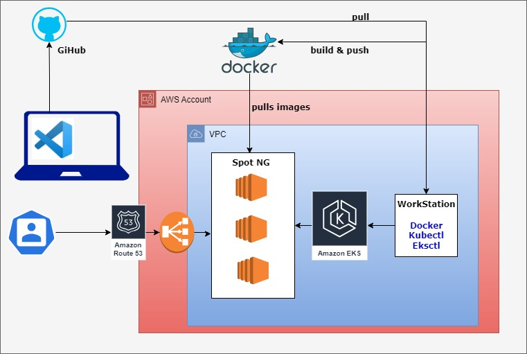

### EKSCTL

We can use AWS eksctl command line approach to create EKS cluster. Setup is like below.

### Workstation
1. We are using our **devops-practice** AMI for workstation.
2. Workstation need to have below packages installed.
    * Docker
    * Kubectl
    * Eksctl
    * Kubens
Run the script to install automatically.
```
sudo sh workstation.sh
```
3. We are using Default VPC with allow-all security group.
4. Configure AWS. this EC2 instance should have access to provision EKS cluster.
```
aws configure
```

### EKS
EKS is AWS kubernetes service. EKS is the master node completely managed by AWS. We can't have SSH access to it.

* We are going to use EKS managed node group, means we no need to worry about installations, underlying OS, etc.
* We are using spot instances to reduce the bill.
* Create one key-pair and import public key into AWS.

```
eksctl create cluster --config-file=eks.yaml
```

